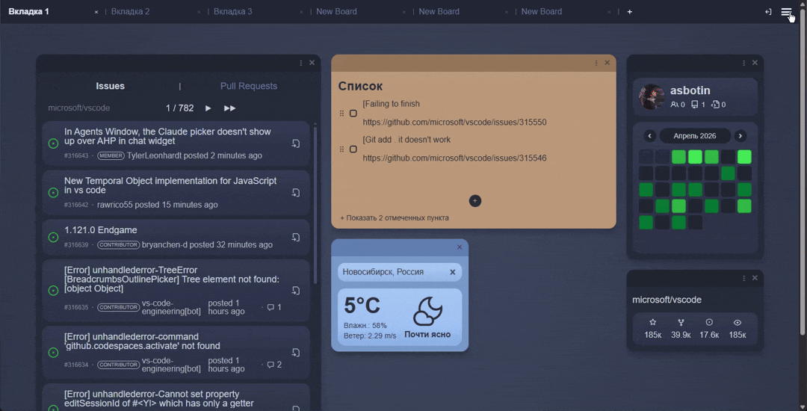
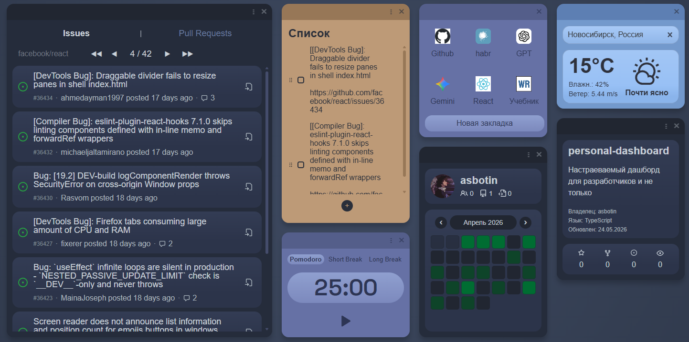
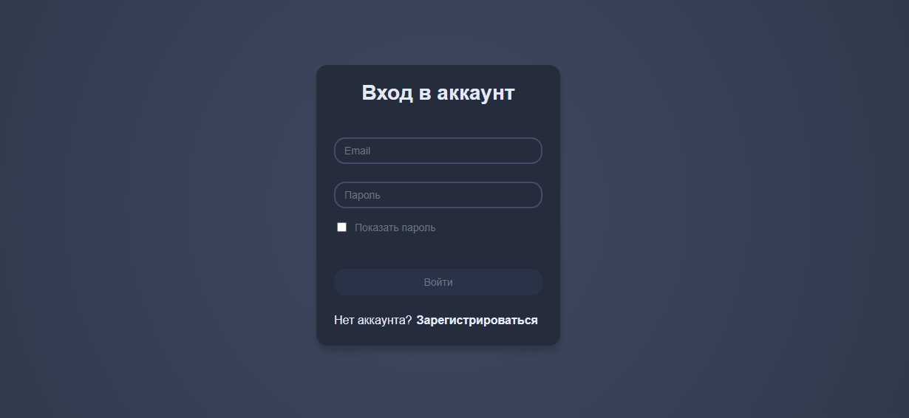
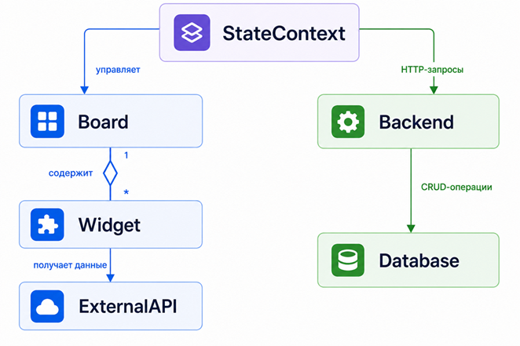

# Personal Dashboard

A modular fullstack productivity dashboard application built with React and Node.js.  
The project features customizable widget-based workspaces, tab-separated dashboards, drag-and-drop interactions, and GitHub API integration for developer-focused tools.

## Live Demo

You can use a live demo at the link:

https://project-knrs8.vercel.app

## Preview

### Dashboard



### Widgets


### Auth



## Features

- Modular widget-based dashboard architecture
- Multiple workspace tabs with independent layouts
- Drag-and-drop widget management
- Dynamic widget creation and removal
- Persistent dashboard state saving
- Responsive interface for desktop and tablet devices
- JWT-based authentication and protected user data
- GitHub API integration for developer-oriented widgets
- Reusable and isolated React component structure
- Real-time UI updates through React state management
- TypeScript-based type safety for core application logic
- REST API communication between frontend and backend
- CSS Modules for scoped and maintainable styling


## Tech Stack

Frontend:
- React
- TypeScript
- CSS Modules
- Vite

Backend:
- Node.js
- Express
- MongoDB
- JWT Authentication

Deployment:
- Vercel
- Render
- MongoDB Atlas


## Architecture diagram



## Installation and Local Setup

### Clone Repository

```bash
git clone https://github.com/your-username/personal-dashboard.git
cd personal-dashboard
```

### Frontend Setup

Install frontend dependencies:

```bash
npm install
```

Start the frontend development server:

```bash
npm run dev
```

Frontend runs on:

```txt
http://localhost:5173
```

### Backend Setup

Move to the backend directory:

```bash
cd backend
```

Install backend dependencies:

```bash
npm install
```

Start the backend server:

```bash
npm run dev
```

Backend API runs on:

```txt
http://localhost:5000
```

---

## Environment Variables

### Frontend (`/.env.local`)

```env
VITE_API_URL=http://localhost:5000/api
VITE_GITHUB_TOKEN=your_token
```

### Backend (`/backend/.env`)

```env
MONGO_URI=your_mongodb_connection_string
JWT_SECRET=your_secret_key
CLIENT_URL=http://localhost:5173
```

